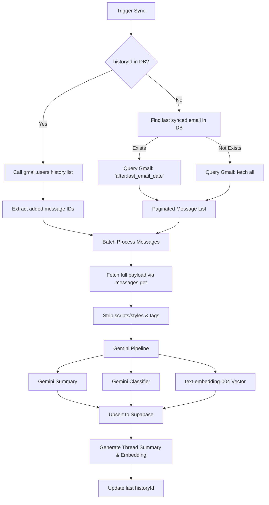

# Architecture & Design Document
## Auto Mail - AI-Powered Email Ingestion & RAG Assistant

This document describes the architectural layout, design patterns, database schemas, AI processing pipelines, and technical trade-offs selected for the Auto Mail workspace technical assessment.

---

## 1. System Topology & Flow Architecture

The application is structured into a clean monorepo topology containing a Next.js 15+ frontend, a Node.js + Express API backend, and a Supabase PostgreSQL database equipped with the `pgvector` extension.

```
                +---------------------------------+
                |      Next.js 15 Dashboard       |
                |  (Light/Dark Glassmorphic UI)   |
                +----------------+----------------+
                                 |
                        REST APIs & WebSockets
                                 |
                                 v
                +---------------------------------+
                |       Express TS Backend        |
                |    (Controller-Service Flow)    |
                +----+-----------------------+----+
                     |                       |
            OAuth / Mail APIs          Gemini Gen AI
                     |                       |
                     v                       v
            +--------+-------+     +---------+-------+
            |   Gmail API    |     |   Gemini Engine |
            | (Google Cloud) |     |  - 2.5 Flash    |
            +----------------+     |  - Embeddings   |
                                   +-----------------+
                                             |
                                  SQL Queries & pgvector
                                             |
                                             v
                             +---------------+---------------+
                             |    Supabase PostgreSQL        |
                             |   (pgvector Similarity)       |
                             +-------------------------------+
```

---

## 2. Ingestion & Synchronization Pipeline (Gmail API)

Syncing mailboxes requires cautious rate-limiting handling and lightweight update tracking. We use a dual-sync workflow:



### Key Optimizations
1. **Fallback Incremental Sync**: When a user doesn't sync for days, their `startHistoryId` expires on Google's servers. Our system intercepts this error and gracefully falls back to a date-based search query (`after:seconds_since_epoch`), guaranteeing ingestion continuity.
2. **Raw HTML Sandbox**: E-mails frequently contain dynamic formatting. The client-side dashboard renders stripped text by default to avoid malicious tag injection but supports a sandboxed `iframe` wrapper to render original HTML safely.

---

## 3. Database Schema Mappings (Drizzle ORM)

We maintain strict naming boundaries: **snake_case** in database tables and columns, and **camelCase** in TypeScript code. Drizzle is configured to translate properties dynamically.

```typescript
// Example ORM Schema Translation (src/db/schema.ts)
export const gmailAccounts = pgTable('gmail_accounts', {
  id: uuid('id').defaultRandom().primaryKey(),
  userId: uuid('user_id').references(() => users.id, { onDelete: 'cascade' }).notNull(),
  accessToken: text('access_token').notNull(),
  refreshToken: text('refresh_token').notNull(),
  expiresAt: timestamp('expires_at', { withTimezone: true }).notNull(),
  historyId: varchar('history_id', { length: 255 }),
});
```

### pgvector Custom Type Definition
Since Drizzle does not bundle vector support by default, we developed a typesafe custom type using `customType` to bind float arrays directly to vector columns:
```typescript
const pgVector = customType<{ data: number[]; config: { dimensions: number } }>({
  dataType(config) {
    return `vector(${config?.dimensions})`;
  },
  toDriver(value: number[]): string {
    return `[${value.join(',')}]`;
  },
  fromDriver(value: unknown): number[] {
    if (typeof value === 'string') {
      return value.slice(1, -1).split(',').map(Number);
    }
    return value as number[];
  },
});
```

---

## 4. Global State & Caching Architecture (Zustand & React Query)

The frontend manages data fetching and user session details using a combination of global memory store (Zustand) and automatic cache queries (TanStack React Query):

```
                                +-----------------------------+
                                |      Next.js Page / View    |
                                +-----+-----------------+-----+
                                      |                 |
                             Zustand Store         React Query Hooks
                          (Theme, User Session)     (Threads List, Chat)
                                      |                 |
                                      +--------+--------+
                                               |
                                               v
                                    +---------------------+
                                    |     API Service     |
                                    +---------------------+
```

### 1. Global Store (Zustand)
- File: [useAppStore.ts](file:///d:/shiva/Repeatless%20Assignment/frontend/src/store/useAppStore.ts)
- **User Session**: Fetched directly on dashboard initialization via `loadUserSession` and held in-memory (not cached in React Query), ensuring real-time profile queries and secure redirect routers.
- **Theme (`'light' | 'dark'`)**: Synced globally. Updates class selectors on the document element directly to provide instantaneous Dark/Light theme shifting.

### 2. Caching Strategy (React Query)
- **Thread Indexes (`['threads', category]`)**: Caches threads index. Invalidation occurs immediately on successful reply dispatch.
- **Thread Detailed Message Logs (`['threadDetails', threadId]`)**: Caches message arrays. Invalidation occurs on successful reply dispatch.
- **Chat Sessions & Conversation Logs (`['chatSessions']`, `['chatHistory', sessionId]`)**: Caches previous session titles and query logs. Invalidation is fired on successful ask-query responses to update history logs without full-page reloads.

---

## 5. Retrieval-Augmented Generation (RAG) System

To ensure that the assistant uses the user's emails as an exclusive knowledge base, the Chat agent executes a semantic lookup:

1. **Embedding user query**: Converts user question to a 768d vector using Gemini `text-embedding-004`.
2. **pgvector similarity search**: Executes a cosine distance calculation using SQL bindings in Drizzle:
   $$\text{Similarity} = 1 - (\text{embedding} \Leftrightarrow \text{query\_embedding})$$
   ```typescript
   const similaritySql = sql<number>`1 - (${emailsTable.embedding} <=> ${queryEmbedding})`;
   const results = await db
     .select({ ..., similarity: similaritySql })
     .from(emailsTable)
     .where(eq(emailsTable.userId, userId))
     .orderBy(sql`${emailsTable.embedding} <=> ${queryEmbedding}`)
     .limit(6);
   ```
3. **Context Injection**: Aggregates top-matching messages and feeds them to `gemini-2.5-flash` under strict instructions to answer *only* from the context and refuse hallucination.
4. **Source Citations**: Enforces the LLM to output the exact Gmail Message IDs in brackets (e.g., `[messageId]`). The Next.js client intercepts this pattern to render clickable inline citation badges linking to email preview side-panels.

---

## 6. Thread-Safe Reply Routing

When sending replies, maintaining threading in mail clients requires setting specific MIME headers. Simply matching the subject line is insufficient. The `GmailService` maps headers as follows:

- **In-Reply-To**: Must match the `Message-ID` header of the last message in the thread.
- **References**: Must append the `Message-ID` of the last message to the existing thread references chain.
- **Subject**: Must match original subject (prefixed with `Re: ` if missing).
- **MIME Formatting**:
  ```typescript
  const mailLines = [
    `To: ${replyTo}`,
    `Subject: ${replySubject}`,
    `In-Reply-To: ${lastMessageId}`,
    `References: ${references}`,
    `MIME-Version: 1.0`,
    `Content-Type: text/html; charset=utf-8`,
    '',
    body
  ];
  ```
  The payload is formatted as a web-safe Base64 string (`replace(/\+/g, '-').replace(/\//g, '_').replace(/=+$/, '')`) and dispatched using `gmail.users.messages.send` with the corresponding `threadId`.

---

## 7. Technical Design Decisions & Trade-offs

| Decision | Selected Tech | Trade-off / Rationale |
| :--- | :--- | :--- |
| **Model Selection** | `gemini-2.5-flash` | Selected for extreme speed, low latency, and 1M+ token context window, making it perfect for combining large email threads. |
| **Vector Engine** | Supabase `pgvector` | Storing embeddings in the primary database avoids the operational complexity of managing external vector services (e.g. Pinecone). |
| **Monorepo Layout** | Decoupled client & server | Keeps the React client clean and allows the Express backend to run long sync processes in the background without blocking Next.js page renders. |
| **Drizzle ORM** | Schema-as-code | Guarantees database changes are tracked in source code and compiles typesafely, reducing database runtime mismatches. |
